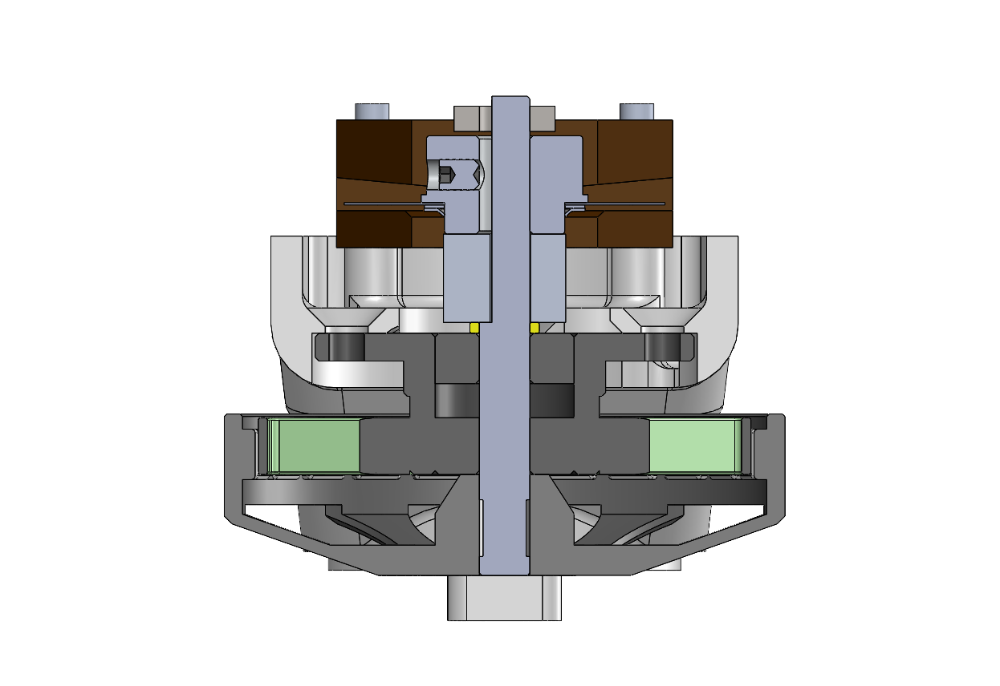

# Senior year project

For my Senior year project, the idea was to build a low cost quadruped robot for research purposes. For that, it was used the open source [Open Dynamic Robot Initiative](https://open-dynamic-robot-initiative.github.io), a project focused on a low cost and low complexity actuator module using brushless motors with 3D part structure to be used to build legged robots and manipulators. They have a [github](https://github.com/open-dynamic-robot-initiative/open_robot_actuator_hardware) where you can find the projects of the actuator, the eletronics and the robots.

## Solo8

For the project, it was chose Solo8, a quadruped robot with 8 degrees of freedom, 2 for each legs. For more informations you can see this [paper](https://arxiv.org/pdf/1910.00093.pdf).

## Changes

Besides the main purpose of the orignal project is to begin affordable to build, changes still were necessary for its viability for the Labrob, besides some improves.

### Belt and pulleys

### Motor Shat

  

### Actuator structure

### Body structure

### Eletronics

Because of problems with building the controller µDriver, it wasn't possible to finish the whole robot. For the purpose of validation, it was used the controller Odrive to move one leg.

## Result

### Building

### Test
[video](https://youtube.com/shorts/DaOwqasF-28)

## Future works

